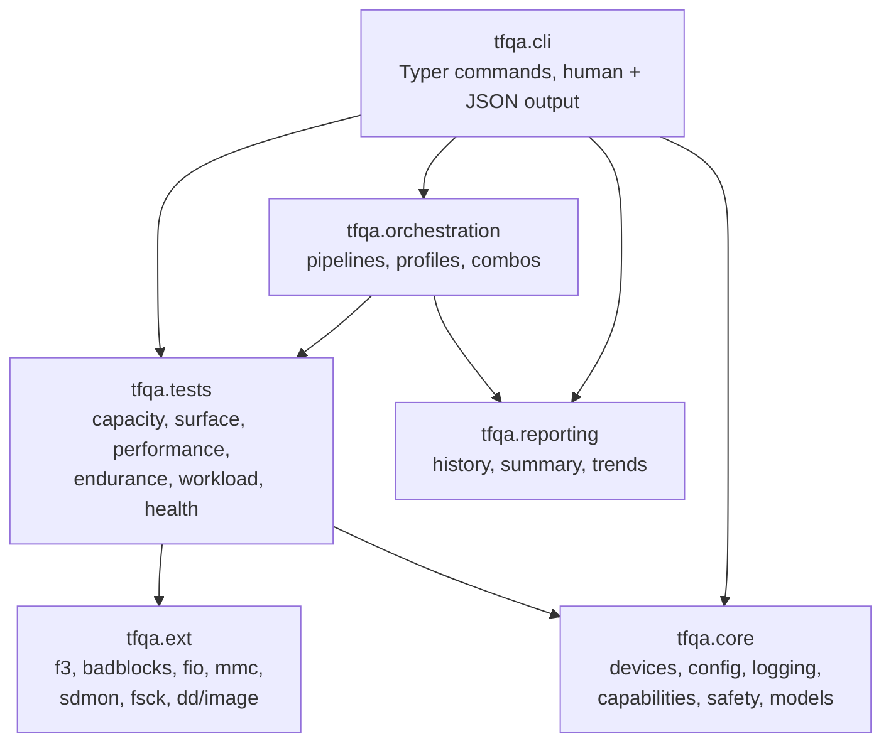

# FlashCrucible

**A Linux command-line tool for testing microSD / TF cards.** It tells you whether a card is
counterfeit, whether its surface is failing, how fast it really is, and how much life it has left.

The CLI is called `tfqa`.

```bash
uv sync
uv run tfqa detect                    # what cards are attached?
uv run tfqa capabilities              # which test tools does this host have?
uv run tfqa quick-test --device /dev/sdX --dry-run
```

> **Status: early development.** The CLI surface, JSON schemas, safety guardrails, and test
> harness are real and working. `full-capacity-test` is still a stub. Read [Safety](#safety) and
> [Known limitations](#known-limitations) before pointing this at a card you care about.

---

## Why this exists

Counterfeit SD cards are everywhere, and the existing tooling is scattered across platforms and
output formats. `f3probe` finds fake capacity but prints prose. `badblocks` scans surfaces but
knows nothing about card health. `fio` benchmarks but needs hand-written job files. H2testw and
CrystalDiskMark are Windows-only. None of them emit machine-readable results, so stitching them
into a repeatable QA process means writing throwaway parsers every time.

FlashCrucible wraps the good Linux tools behind one CLI with **one stable output contract**. Every
command returns the same JSON envelope, writes structured JSONL events, and appends to a run
history you can trend over time. It is built so a human and an AI agent can drive the same
commands and read the same results.

## What it does

| Command | What it does | Writes to device? |
| --- | --- | --- |
| `detect` | List block devices with size, bus, removability | No |
| `capabilities` | Probe which external tools are installed | No |
| `quick-test` | Fast counterfeit / capacity check via `f3probe` | **Yes** |
| `full-capacity-test` | Destructive full-span write + verify | **Yes** (stub) |
| `surface-scan` | Bad-block sweep via `badblocks`, with health snapshot | **Yes** |
| `performance` | Throughput / latency / IOPS via `fio`, synthetic fallback | **Yes** |
| `endurance` | Burn-in loop, profile-driven | **Yes** |
| `workload-smallfiles` | Small-file create/read/delete metadata stress | **Yes** |
| `image-flash` | Write an image with `dd`, verify with `cmp` | **Yes** |
| `filesystem-check` | Run `fsck` against the filesystem | Only with `--force` |
| `health` | Read CID / wear registers (sysfs, `mmc extcsd`, `sdmon`) | No |
| `pipeline` | Run several stages as one orchestrated run | **Yes** |
| `combos`, `profiles` | List curated workflows and endurance presets | No |
| `describe`, `describe-schemas` | Machine-readable command and schema discovery | No |
| `validate-schemas`, `lint-schemas` | Check the shipped JSON schemas | No |
| `history`, `trends`, `report`, `automation-report` | Query and aggregate past runs | No |
| `config show`, `config validate` | Inspect the merged configuration | No |

Run `uv run tfqa --help` for the full list, or `uv run tfqa describe <command> --output json` for
a command's complete argument schema.

## Install

Requires **Python 3.13+** and [`uv`](https://docs.astral.sh/uv/).

```bash
git clone git@github.com:grammy-jiang/FlashCrucible.git
cd FlashCrucible
uv sync
uv run tfqa --help
```

The external tools are optional — `tfqa capabilities` reports what is present and each command
degrades or errors clearly when its tool is missing.

```bash
# Debian / Ubuntu
sudo apt install f3 e2fsprogs fio mmc-utils

# Fedora / RHEL
sudo dnf install f3 e2fsprogs fio mmc-utils
```

## Quick tour

```bash
# 1. Find the card. Never assume a device path.
uv run tfqa detect

# 2. Check what this host can actually test with.
uv run tfqa capabilities

# 3. Preview a test without touching the card.
uv run tfqa quick-test --device /dev/sdX --dry-run

# 4. Run it for real (this writes to the card).
uv run tfqa quick-test --device /dev/sdX

# 5. Look at what past runs recorded.
uv run tfqa history
uv run tfqa trends --stage quick-test
```

Replace `/dev/sdX` with a real path from step 1. There is no default device, by design.

## Safety

**Never destructive by default, always explicit.**

- No command defaults to a device. You must pass `--device`.
- Every command that writes raw blocks calls `assert_safe_for_destructive()` from
  `tfqa/core/safety.py`, which refuses a device that is mounted or looks like a system disk.
- Overriding a refusal takes **both** `--force` and `--yes`. `--force` on its own is treated as an
  unconfirmed request, so a stray flag left in a script cannot arm a destructive run.

```bash
uv run tfqa quick-test --device /dev/sdX                 # refused if /dev/sdX is mounted
uv run tfqa --yes quick-test --device /dev/sdX --force   # explicit override
```

A refusal exits with code `3` and `error_code: DEVICE_UNSAFE`, and the payload names the reason
(`mountpoints`, `is_system_disk`) so automation can act on it.

Read-only paths stay usable on a mounted card: `surface-scan --mode readonly`, a `pipeline` whose
stages are all non-writing, `detect`, `health`, and every reporting command. `workload-smallfiles`
writes through a mounted filesystem, so it is intentionally exempt from the unmounted requirement.

### Dry runs

Every command that writes accepts `--dry-run`, as a global flag before the subcommand or as the
command's own flag after it. Both forms print the plan and execute nothing.

```bash
uv run tfqa --dry-run pipeline --device /dev/sdX --stages detect,quick-test
uv run tfqa quick-test --device /dev/sdX --dry-run
```

The plan carries a `safety` block reporting whether the real run would clear the guard, so you
can find out that a card is mounted without attempting the write:

```json
{
  "plan": {
    "device": "/dev/sdX",
    "stage_plan": ["detect", "quick-test"],
    "writes_to_device": true,
    "safety": {
      "would_run": false,
      "error_code": "DEVICE_UNSAFE",
      "reason": "has active mountpoints. Use --force --yes ...",
      "details": {
        "device_path": "/dev/sdX",
        "mountpoints": [{ "mountpoint": "/media/boot", "fstype": "vfat" }]
      }
    }
  }
}
```

The four `safety` keys are always present — on a clearing device they are
`{"would_run": true, "error_code": null, "reason": null, "details": {}}` — so automation never
has to handle two shapes.

Commands that never clear the unmounted requirement (`workload-smallfiles`,
`surface-scan --mode readonly`, read-only pipeline plans) omit the `safety` block rather than
predict a refusal that does not apply.

A dry run applies the same argument validation as a real run, so it will not hand back a plan the
real invocation would reject (`--mode typo`, `--duration 0`, `--file-count 0`, …).

## Automation and AI

Every command returns the same envelope, defined by `tfqa/data/schemas/json/cli_response.schema.json`:

```json
{
  "status": "ok",
  "command": "quick-test",
  "run_id": "...",
  "device": "/dev/sdX",
  "error_code": null,
  "message": "...",
  "data": { "metrics": {}, "details": {} },
  "log_path": "..."
}
```

```bash
TFQA_MODE=ai uv run tfqa detect     # shorthand for --output json --non-interactive --no-color
```

Discovery hooks let an agent learn the CLI without hardcoding it:

- `tfqa describe <command> --output json` — arguments, defaults, destructive flag, privileges
- `tfqa describe-schemas --output json` — every shipped JSON schema with title and version
- `tfqa capabilities --output json` — which tools and features are available on this host

Exit codes are stable (`tfqa/core/error_codes.py`):

| Code | Meaning |
| --- | --- |
| `0` | Success |
| `1` | Test ran and failed |
| `2` | Invalid arguments or configuration |
| `3` | Environment problem — missing tool, permissions, unsafe device, I/O error |

## How it is organised



| Path | Contents |
| --- | --- |
| `tfqa/cli/main.py` | Every command, argument parsing, output rendering |
| `tfqa/core/` | Device detection, config merge, logging, capability probe, safety, Pydantic models |
| `tfqa/tests/` | Test engines, one package per category |
| `tfqa/ext/` | Thin wrappers around external binaries |
| `tfqa/orchestration/` | Pipeline sequencing, endurance profiles, workflow combos |
| `tfqa/reporting/` | Run history index, summaries, trend aggregation |
| `tfqa/data/schemas/json/` | 8 JSON schemas describing the output contract |
| `tfqa/data/profiles/`, `tfqa/data/workflows/` | Endurance presets and curated stage combos |
| `docs/` | Design notes, roadmap, tool study, UX requirements |

## Configuration

Precedence, lowest to highest:

```
defaults < /etc/tfqa/config.toml < ~/.config/tfqa/config.toml < ./tfqa.toml < TFQA_* env vars < CLI flags
```

See `examples/tfqa.toml` for a starting point, and `uv run tfqa config show` to see what the CLI
actually resolved.

Recognised environment variables: `TFQA_MODE`, `TFQA_LOG_DIR`, `TFQA_NON_INTERACTIVE`,
`TFQA_PROFILES_DIR`, `TFQA_SCHEMAS_DIR`, `TFQA_WORKFLOWS_DIR`.

## Development

```bash
uv sync                          # create venv, install deps
uv run pytest -q                 # 174 tests, ~1s
uv run ruff check .              # lint
uv run ruff format .             # format
uv run mypy tfqa/ tests/         # type check
uv run tfqa validate-schemas     # check the JSON schemas parse
```

CI runs all five on every push and pull request. See [CONTRIBUTING.md](CONTRIBUTING.md).

CLI tests use Typer's `CliRunner` with `unittest.mock.patch` to stub device access, so the suite
never touches real hardware.

## Known limitations

Honest list of what does not work yet. Contributions welcome.

1. **`full-capacity-test` is a stub.** `tfqa/tests/capacity/full.py:21` returns canned numbers
   without touching the device.
2. **Pydantic deprecation warnings.** `tfqa/core/models.py` still uses class-based `Config`;
   migrating to `ConfigDict` is pending.
3. **Health data needs the right hardware.** Wear data comes from eMMC `EXT_CSD` registers
   (usually root) or from `sdmon` on industrial SD cards. A consumer card in a USB reader can
   supply neither, so `tfqa health` reports what is unavailable and why rather than guessing.

## Documentation

| Document | What it covers |
| --- | --- |
| [docs/cli-guide.md](docs/cli-guide.md) | Detailed notes on individual commands, payloads, and automation hooks |
| [docs/tool-wrapping-strategy.md](docs/tool-wrapping-strategy.md) | Which external tools are wrapped, and what must be built natively |
| [docs/design-v0-structure.md](docs/design-v0-structure.md) | Module and package architecture |
| [docs/design-v0-details.md](docs/design-v0-details.md) | Detailed design notes |
| [docs/features-roadmap-v0.md](docs/features-roadmap-v0.md) | Feature priorities and phase plan |
| [docs/sd-tools-study-v0.md](docs/sd-tools-study-v0.md) | Survey of existing microSD test tools |
| [docs/ux-v0.md](docs/ux-v0.md) | CLI UX requirements |
| [docs/phase3-4-plan.md](docs/phase3-4-plan.md) | Endurance, orchestration, and automation work plan |

## Platform support

Linux only: x86_64, arm32, arm64. Tested against Debian/Ubuntu and Fedora/CentOS/RHEL families.
